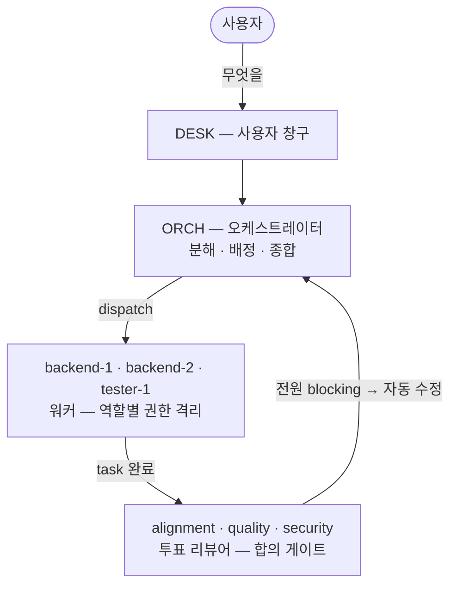

# AWA — Agents Watching Agents


> 멀티 에이전트 팀이 plan을 닻 삼아 일하고, **에이전트가 에이전트를 감시한다.**

AWA는 오케스트레이션 도구가 아니라 **감독된 자율성(Supervised Autonomy) 플랫폼**이다 — 자율은 에이전트에게, 검증·권한·안전은 시스템에게.

---

## 왜 — 에이전트에게 큰 작업을 맡기면 생기는 일

| | 문제 | AWA의 답 |
|---|---|---|
| 🟥 | **False green** — 에이전트가 쓴 테스트는 에이전트가 쓴 코드의 맹점을 공유한다 | 독립 리뷰어 3종(plan 정합·품질·보안)이 **투표** — 만장일치 차단이면 자동 수정 |
| 🟧 | **권한 폭주** — 매번 물으면 사람이 병목(실측 58회), 전부 허용하면 `rm -rf` 한 번에 끝 | 승인한 패턴은 **학습**해 다시 안 묻고, 위험 명령은 **누구도 우회 불가**로 자동 거부 |
| 🟨 | **컨텍스트 절단** — auto-compact가 task 중간에 끼어들어 흐름을 끊는다 | task 경계마다 **선제 정리** — 흐름은 컨텍스트가 아니라 파일에 저장 |

## 어떻게 — 감시 구조



워커의 "끝났다"는 그대로 믿지 않는다 — task가 끝날 때마다 **독립 컨텍스트의 리뷰어들이 투표**하고, 만장일치 차단이면 사람 없이 수정시킨다. 모든 신호는 파일 IPC로 흐르며(화면 파싱 없음), 감시는 네 축으로 상시 작동한다:

| 어휘 | 한 줄 |
|---|---|
| `plan-anchored` | plan은 읽고 버리는 문서가 아니라 전 구간의 닻 — task마다 기준 명시·검증 |
| `drift-tracked` | 의도에서 벗어나는 순간을 시계열로 상시 추적 |
| `permission-gated` | 권한은 매번 묻지 않고 학습 — 질문이 0으로 수렴 |
| `deny-bounded` | 위험 명령은 사람·ORCH도 우회 불가한 한계선에서 자동 거부 |

## 증거 — 숫자로

동일 plan(재고·주문 트랜잭션 API, 불변식 5종)을 단일 에이전트 1회 + AWA 3회 실행한 자체 실측:

| 실행 | 사람 개입 | 토큰 (5h) | 시간 | 결과 |
|---|---|---|---|---|
| 단일 에이전트 | **58회** | 17% | 39분 | 완주 — 권한 질문이 병목 |
| AWA 1차 | **2회** (28배↓) | 15% | 40분 | 완주 + IDOR 결함 3라운드 차단 |
| AWA 2차 | 3회 | 17% | 45분 | 완주 + 합의 게이트 만장일치 작동 |
| AWA 3차 | 7회* | 19% | 40분 | 9 task 클린 완주 + **false-green 2건 실차단** |

> **감독 회로를 얹어도 비용은 단일 에이전트와 동급.** *3차의 7회는 결함 차단→수정 승인 등 게이트의 정당 개입.
>
> 게이트가 잡은 false green: 테스트 64개가 전부 통과했지만 — ① JWT 키 불일치로 실 인증에선 전 요청 500 ② 테스트가 구현에 맞춰 작성돼 spec 계약 위반. **둘 다 자기보고로는 못 잡는다.**

권한 질문은 학습으로 0에 수렴:


## 안전 모델 — 권한을 끄지 않는다

ask가 적다고 `--dangerously-skip-permissions`가 아니다. CLI의 대화형 프롬프트 대신 **hook 레벨 게이트가 모든 도구 호출을 분류**한다 — deny 판정엔 LLM의 판단이 개입하지 않는다:

```
danger  →  자동 거부        deny 카탈로그 매칭 (사람·ORCH도 우회 불가)
matrix  →  역할별 자동 허용   기본 allow 카탈로그 매칭
auto    →  학습된 패턴       이전에 영구 승인한 것
gray    →  사람에게 질문     승인 시 allow 에 영구 학습 ── ask 가 여기서만 발생
```

**deny — 기본 차단 21종** (하드코딩, 작업 중 변경 불가):

```
rm -rf · sudo · git push --force · git reset --hard · git clean -f
curl|sh · wget|sh · eval stdin · fork bomb · dd 쓰기 · chmod 777
~/.ssh · 자격증명 파일(.env 등) · 시스템 설정 쓰기 · $HOME/하니스 삭제 …
```

**allow — 기본 허용 10개 카테고리 + 학습**:

```
read-only (ls·cat·grep·jq …) · version-probe · git-readonly
safe-test (npm test …) · safe-build · dev-deps (npm install …)
safe-fs · git-write (commit) · self-verify · harness-infra
learned  ← 작업 중 사람이 승인한 패턴이 여기 누적 (재가동에도 유지)
```

**deny는 고정된 바닥, allow는 작업하며 자라는 천장** — 사이클이 돌수록 질문이 줄어 0으로 수렴하는 것이지, 검사가 사라지는 게 아니다.

## 설치

```bash
# 의존성: tmux · jq · claude (Claude Code CLI) · uuidgen
git clone https://github.com/taehyunan-99/awa.git
cd awa/.claude/skills/awa && bash install.sh
```

## 사용

```bash
cd <프로젝트> && claude
> /awa        # 인터뷰가 팀을 조립해 .awa/team.yaml 저장 + tmux 가동
```

1. **DESK**에 작업을 말한다 → ORCH가 분해·배정 트리를 보여주고 승인 1회
2. 이후 자율 진행 — 판단 필요할 때만 등급(🔴위험 🟠판단 🔵권한 🟢승인)으로 사람을 부름

```bash
> 오늘은 여기까지                      # 드레인 — 진행 중 task만 마치고 정지
$ harness/bin/awa-down.sh             # 정리 (산출물 보존)
$ harness/bin/awa-up.sh --spec .awa/team.yaml   # 재가동 — 완료분 건너뛰고 이어서
```

---

**Contact** — [@taehyunan-99](https://github.com/taehyunan-99)
