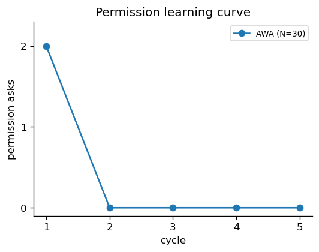

# AWA — Agents Watching Agents


**Plan-anchored · Drift-tracked · Permission-gated · Deny-bounded**

> 멀티 에이전트 팀이 plan을 닻 삼아 일하고, **에이전트가 에이전트를 감시한다.**

---

## TL;DR

- AWA는 멀티 에이전트 **오케스트레이션 도구가 아니라 감독된 자율성(Supervised Autonomy) 플랫폼**이다.
- tmux 위에 오케스트레이터(ORCH)·사용자 창구(DESK)·워커·리뷰어 팀을 띄우고, plan을 task로 분해해 자율 진행한다.
- 워커가 "끝났다"고 해도 믿지 않는다 — **리뷰어 합의 게이트**가 plan 정합·코드 품질·보안을 독립 투표로 판정하고, 만장일치 차단이면 자동으로 수정시킨다.
- 권한 질문은 **학습**된다 — 한 번 승인한 명령 패턴은 다시 묻지 않고, 위험 명령은 누구도(사람 포함) 우회할 수 없는 한계선에서 자동 거부된다.
- 실측: 동일 plan 기준 단일 에이전트 대비 **권한 질문 58회 → 2회**, 토큰 사용량은 동급. 자기보고 테스트가 놓친 **false-green 결함 2건을 리뷰 게이트가 실차단**.

## 목차

- [왜 AWA인가](#왜-awa인가)
- [핵심 설계 — 감독된 자율성](#핵심-설계--감독된-자율성)
- [실측](#실측)
- [아키텍처](#아키텍처)
- [설치](#설치)
- [Quick Start](#quick-start)
- [팀 명세 — team.yaml](#팀-명세--teamyaml)
- [안전 모델](#안전-모델)
- [FAQ](#faq)

---

## 왜 AWA인가

에이전트에게 규모 있는 작업을 맡기면 세 가지 문제가 반복된다.

**1. False green — 자기보고는 믿을 수 없다.**
에이전트가 작성한 테스트는 에이전트가 작성한 코드의 맹점을 공유한다. "테스트 전부 통과"가 실제로는 깨진 코드인 경우가 실재한다 — 실측에서 JWT 토큰 키 불일치(테스트는 통과, 실 인증 흐름에선 전 요청 500)와 spec 계약 위반(테스트가 구현에 맞춰 작성됨)이 정확히 이 패턴이었다.

**2. 권한 질문 폭주 — 사람이 병목이 된다.**
긴 작업에서 도구 호출마다 승인을 물으면 사람이 수십 번 불려온다. 그렇다고 전부 자동 승인하면 `rm -rf` 한 번에 끝난다.

**3. 컨텍스트 절단 — 임의 압축이 흐름을 끊는다.**
CLI의 자동 압축(auto-compact)은 기준 없이 task *중간*에 끼어든다. 흐름이 끊긴 에이전트는 방금 한 결정을 잊는다.

AWA는 이 셋을 **감독 구조**로 푼다: 검증은 독립 컨텍스트의 리뷰어 투표로, 권한은 학습형 게이트로, 컨텍스트는 task 경계에서 선제 정리로.

## 핵심 설계 — 감독된 자율성

에이전트는 자율적으로 일하되, 그 자율성은 네 축으로 감독된다.

| 어휘 | 의미 | 구현 |
|---|---|---|
| `plan-anchored` | plan은 시작할 때 읽고 버리는 문서가 아니라 전 구간의 **닻**이다 | task마다 acceptance criteria 명시, 리뷰어가 plan 대비 정합 검증, plan 결함은 `@plan-defect`로 역방향 보고 |
| `drift-tracked` | 의도에서 벗어나는 순간을 **상시 추적**한다 | review-manager가 plan-diff 시계열 기록, watcher가 정체(stall)·드리프트 신호 발화 |
| `permission-gated` | 권한은 매번 묻지 않고 **학습**한다 | 한 번 승인한 명령 패턴은 영구 카탈로그에 누적 — 사이클이 돌수록 질문이 0으로 수렴 |
| `deny-bounded` | 위험 명령은 **누구도 우회 불가**한 한계선에서 차단 | `rm -rf`·`sudo`·`dd`·`curl\|sh` 등 deny 카탈로그 자동 거부 — 사람·오케스트레이터도 예외 없음 |

여기에 두 개의 운영 회로가 얹힌다.

**리뷰어 합의 게이트** — 워커가 task를 끝낼 때마다 plan 정합(alignment)·코드 품질(quality)·보안(security) 리뷰어가 **각자 독립 컨텍스트에서** 판정을 투표한다. 전원 `blocking`이면 자동 차단 + 수정 지시, 의견이 갈리면 근거를 첨부해 사람에게 묻는다(단독 리뷰어의 과엄격 견제). 같은 자아가 역할극으로 자기검증하는 것과 달리, **자기가 쓴 테스트의 맹점을 남이 본다**.

**일시정지와 재개(resume)** — "오늘 여기까지"라고 하면 진행 중인 task만 마치고 멈춘다(드레인). 다음 가동 때는 세션을 복원하는 게 아니라 **영속 산출물(task 정의 + 완료 증거)을 대조**해 어디서부터인지 도출한다 — 완료된 task는 재실행하지 않는다.

## 실측

동일한 plan(재고·주문 트랜잭션 API — 인증·동시성 재고차감·결제 멱등성·취소 복원, 불변식 5종)을 단일 에이전트 1회 + AWA 3회로 반복 실행한 자체 실측.

| 실행 | 사람 개입(ask) | 토큰 (5h 게이지) | 시간 | 결과 |
|---|---|---|---|---|
| 단일 에이전트 (기준) | **58회** | 17% | 약 39분 | 완주 — 권한 질문이 사람 병목 |
| AWA 1차 | **2회** (28배↓) | 15% | 약 40분 | 완주 · security 리뷰어가 IDOR 결함 3라운드 차단 |
| AWA 2차 | 3회 | 17% | 약 45분 | 완주 · 합의 게이트 3종 만장일치 첫 작동 |
| AWA 3차 | 7회* | 19% | 약 40분 | **9 task 클린 완주 · 테스트 64개 통과 · false-green 2건 실차단** |

*3차의 ask 7회는 false-green 차단→수정 지시·수정 task 분기 승인 등 **게이트의 정당 개입**이 포함된 수치 — 단순 권한 질문이 아니다.

세 번의 반복에서 토큰 비용(15→17→19%)과 시간(40~45분)이 안정적으로 유지됐다 — 감독 회로(리뷰 3종 투표·드리프트 추적)를 얹어도 단일 에이전트와 동급 비용이라는 게 핵심이다.

게이트가 잡은 false green 2건:
1. **JWT 토큰 키 불일치** — 테스트는 토큰을 직접 주입해 전부 통과했지만, 실 인증 흐름에선 모든 주문이 500. quality 리뷰어가 인메모리 실험 + 코드 추적으로 적발 → 자동 차단 → 수정.
2. **spec 계약 위반** — 테스트가 구현의 필드명에 맞춰 작성돼 통과했지만 spec과 불일치. 리뷰어 3종이 지적 → 수정 task 분기로 해소.

권한 학습 곡선 — 첫 사이클에서 승인한 패턴이 누적돼 2사이클부터 질문 0:



## 아키텍처

```
tmux 세션 awa-<project>
┌──────────────────┬──────────────────┐
│       ORCH       │       DESK       │   사용자는 DESK와 대화("무엇을"),
│  (오케스트레이터)  │   (사용자 창구)   │   ORCH는 분해·배정·종합("어떻게")
├──────────────────┴──────────────────┤
│   backend-1   backend-2   tester-1  │   워커 — 역할별 권한 템플릿로 격리
├─────────────────────────────────────┤
│  alignment   quality    security    │   투표 리뷰어 — 합의 게이트 (만장일치 차단)
│             review-mgr              │   메타 리뷰 — 드리프트 시계열
└─────────────────────────────────────┘
          ▲  파일 IPC (events.log · dispatch-queue · verdict)
          │  watcher 데몬이 폴링해 해당 pane을 깨움
```

설계 원칙: **에이전트는 서로의 화면을 파싱하지 않는다.** 모든 신호는 구조화된 파일(5필드 이벤트 로그·verdict 헤더·atomic 큐)로 흐르고, watcher 데몬이 파일을 폴링해 필요한 pane만 깨운다. 워커는 sandbox 안이라 tmux에 직접 접근할 수 없다 — 격리가 곧 안전선이다.

## 설치

의존성: `tmux` `jq` `claude` (Claude Code CLI) `uuidgen` — macOS 기본 bash 3.2 호환.

```bash
git clone https://github.com/taehyunan-99/awa.git
cd awa/.claude/skills/awa
bash install.sh
```

`~/.claude/skills/awa`로 설치되어 모든 프로젝트에서 `/awa` 스킬로 쓸 수 있다.

## Quick Start

```bash
cd <작업할 프로젝트>
claude
```

```
> /awa
```

`/awa` 인터뷰가 plan을 확인하고 작업에 맞는 팀을 조립해 `.awa/team.yaml`로 저장한 뒤 tmux 팀을 가동한다. 이후의 흐름:

1. **DESK**에 작업을 말한다 — "재고 API 만들어줘"
2. **ORCH**가 plan을 task로 분해하고 배정 트리를 보여준 뒤 승인을 받는다 (이 1회가 마지막 필수 개입)
3. 워커들이 자율 진행 — task 완료마다 리뷰어 3종이 투표, 차단이면 자동 수정
4. 판단이 필요한 순간만 등급 이모지(🔴 위험 / 🟠 판단 / 🔵 권한 / 🟢 승인)로 사람을 부른다

**멈추고 이어가기:**

```
> (DESK에) 오늘은 여기까지            # 드레인 — 진행 중 task만 마치고 정지
$ .claude/skills/awa/harness/bin/awa-down.sh    # 정리 (산출물은 보존)

# 다음 날
$ <harness>/bin/awa-up.sh --spec .awa/team.yaml  # 완료분은 건너뛰고 이어서
```

## 팀 명세 — team.yaml

팀은 정적 프리셋이 아니라 작업에 맞춰 동적으로 조립된다. `/awa` 인터뷰가 생성하며, 직접 써도 된다:

```yaml
layout: grid
plan: docs/plan.md          # 재가동 시 자동 재주입

workers:
  - name: backend-1
    role: backend
  - name: tester-1
    role: tester

reviewers:
  - name: alignment-rev
    role: reviewer-alignment
  - name: quality-rev
    role: reviewer-quality
  - name: security-rev
    role: reviewer-security
  - name: review-mgr
    role: review-manager
```

투표 리뷰어가 1명뿐인 팀은 부팅이 거부된다 — 단독 거부권은 합의가 아니다(불변식).

## 안전 모델

명령은 실행 전 4단계로 분류된다:

```
danger  → 자동 거부 (rm -rf · sudo · dd · curl|sh · git push --force …)
            사람·ORCH 포함 누구도 우회 불가 (deny-bounded)
matrix  → 역할별 자동 허용 카탈로그 매칭 (읽기·빌드·테스트류)
auto    → 학습된 패턴 자동 허용 (이전에 영구 승인한 것)
gray    → 사람에게 질문 → 승인 시 영구 학습 (permission-gated)
```

- 워커마다 **역할별 권한 템플릿**(settings.json)이 따로 생성된다 — 리뷰어는 읽기 전용, 워커는 작업 경로만 쓰기.
- 학습된 허용 패턴은 프로젝트별 `learned-allow.yaml`에 누적 — 팀을 재가동해도 유지된다.
- 복합 명령(`&&`·`|` 체이닝)은 영구 학습이 자동 강등된다 — 안전한 prefix를 도출할 수 없는 패턴은 학습하지 않는다.

## FAQ

**Q. 에이전트를 9개나 띄우면 토큰이 폭증하지 않나?**
실측 기준 단일 에이전트와 동급(5h 게이지 15~19%)이었다. 리뷰어는 이벤트가 있을 때만 깨어나고(자가 폴링 금지), 워커 컨텍스트는 task 경계마다 정리되며, task가 self-contained라 흐름이 컨텍스트가 아닌 파일에 저장되기 때문.

**Q. 멀티 에이전트가 폭주하면?**
모든 에이전트는 이벤트 반응형이다 — 평소 idle, 신호에 깨어 1회 처리 후 다시 idle. 정체는 watcher가 감지해 ORCH가 pane을 직접 보고 진단하며, 같은 지점에서 반복 정체 시에만 사람을 부른다.

**Q. 세션이 끊기면 처음부터 다시 하나?**
아니다. 진실원천은 세션이 아니라 영속 산출물이다 — task 정의(`tasks/`)와 완료 증거(`results/`)를 부팅 때 대조해 완료분은 건너뛰고 중단분만 재실행한다.

**Q. Claude 외 다른 모델도 쓸 수 있나?**
베이스(ORCH/DESK)는 Claude 전용이다. 워커·리뷰어는 `role:codex` 지정으로 Codex CLI를 섞을 수 있다.

**Q. 위험한 명령을 ORCH가 승인해버리면?**
불가능하다. deny 카탈로그는 분류기(`danger-check.sh`)가 hook 레벨에서 자동 거부하며, 이 경로엔 LLM의 판단이 개입하지 않는다 — 그게 `deny-bounded`의 의미다.

---

**Contact** — [@taehyunan-99](https://github.com/taehyunan-99)
